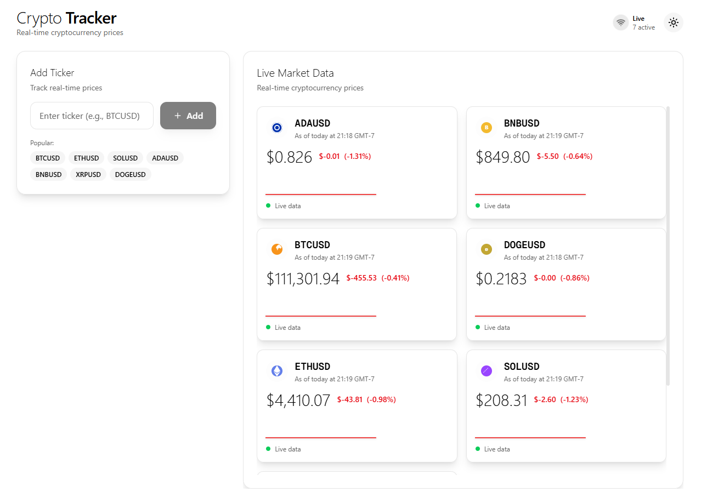

# 🚀 Crypto Price Tracker

A real-time cryptocurrency price tracking application built with Next.js, Node.js, and Playwright for scraping TradingView data. This full-stack application provides live price updates for various cryptocurrencies with a modern, responsive UI.



## ✨ Features

- **Real-time Price Streaming**: Live cryptocurrency prices scraped from TradingView
- **Dynamic Ticker Management**: Add and remove cryptocurrency tickers on the fly
- **Modern UI**: Clean, responsive interface with dark/light theme support
- **WebSocket Communication**: Low-latency real-time updates
- **Scalable Architecture**: Efficient resource sharing for multiple concurrent clients
- **TypeScript**: Full type safety across frontend and backend
- **Playwright Integration**: Automated browser scraping with visual feedback

## 🛠️ Tech Stack

### Frontend
- **Next.js 15** - React framework with App Router
- **TypeScript** - Type-safe development
- **Tailwind CSS** - Utility-first styling
- **Framer Motion** - Smooth animations
- **ConnectRPC** - Type-safe API communication
- **React Query** - Data fetching and caching

### Backend
- **Node.js** - JavaScript runtime
- **Express** - Web framework
- **Playwright** - Browser automation for scraping
- **WebSocket** - Real-time communication
- **ConnectRPC** - gRPC-like API framework
- **TypeScript** - Type-safe development

### Development Tools
- **pnpm** - Fast, disk space efficient package manager
- **ESLint** - Code linting
- **Concurrently** - Run multiple processes
- **nodemon** - Development server auto-restart

## 🚀 Quick Start

### Prerequisites

- **Node.js** >= 18.0.0
- **pnpm** >= 8.0.0
- **Git** (for cloning)

### Installation

1. **Clone the repository**
   ```bash
   git clone https://github.com/yourusername/crypto-price-tracker.git
   cd crypto-price-tracker
   ```

2. **Install dependencies**
   ```bash
   pnpm install --recursive
   ```

3. **Start the application**
   ```bash
   ./run.sh
   ```
   *Note: For Windows users, use `pnpm dev` instead*

4. **Open your browser**
   Navigate to [http://localhost:3000](http://localhost:3000)

### Manual Setup (Alternative)

If you prefer to run the services separately:

1. **Start the backend**
   ```bash
   cd backend
   pnpm dev
   ```

2. **Start the frontend** (in a new terminal)
   ```bash
   cd frontend
   pnpm dev
   ```

## 📖 Usage

1. **Add Tickers**: Enter cryptocurrency symbols like `BTCUSD`, `ETHUSD`, `SOLUSD`
2. **View Prices**: Watch real-time price updates streamed from TradingView
3. **Remove Tickers**: Click the remove button to stop tracking specific cryptocurrencies
4. **Theme Toggle**: Switch between light and dark themes
5. **Responsive Design**: Works seamlessly on desktop and mobile devices

### Supported Tickers

The application supports all cryptocurrency tickers available on TradingView. Popular examples:
- `BTCUSD` - Bitcoin
- `ETHUSD` - Ethereum
- `SOLUSD` - Solana
- `ADAUSD` - Cardano
- `DOTUSD` - Polkadot

## 🔧 Development

### Available Scripts

- `pnpm install:all` - Install all dependencies
- `pnpm dev` - Start both frontend and backend
- `pnpm build` - Build for production
- `pnpm lint` - Run ESLint

## 📝 License

This project is licensed under the MIT License - see the [LICENSE](LICENSE) file for details.

## 👨‍💻 Author

**Surendhar Bandari**